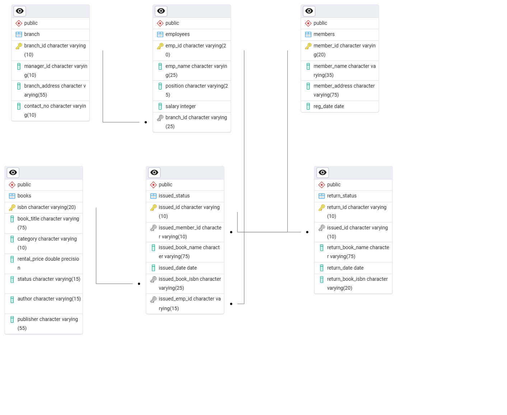

# 📚 Library Management System (Advanced SQL Project)

This project is a **Library Management System** built using PostgreSQL with advanced SQL features such as **stored procedures, triggers, functions, and constraints**.  
It simulates real-world library operations including book issue, book return, employee management, and tracking members.

---

## 📂 Project Files
- **Library_project.sql** → Base schema creation with tables.  
- **Library_project_1.sql** → Extended schema with constraints and sample data.  
- **Librarry_project_advancesql.sql** → Advanced SQL features including stored procedures, triggers, and queries.  
- **ERD_schemas.pgerd** → ERD schema file (can be opened in pgAdmin or DBeaver).  
- **ERD_schemas.pgerd.png** → Entity Relationship Diagram (ERD) image for quick view.  

---

## 🗄️ Database Schema
The database consists of the following main tables:

1. **books**
   - isbn (PK)
   - book_title
   - category
   - rental_price
   - status (yes/no for availability)
   - author
   - publisher  

2. **members**
   - member_id (PK)
   - member_name
   - member_address
   - reg_date  

3. **employees**
   - emp_id (PK)
   - emp_name
   - position
   - salary
   - branch_id (FK → branch)

4. **branch**
   - branch_id (PK)
   - manager_id
   - branch_address
   - contact_no  

5. **issued_status**
   - issued_id (PK)
   - issued_member_id (FK → members)
   - issued_book_name
   - issued_date
   - issued_book_isbn (FK → books)
   - issued_emp_id (FK → employees)

6. **return_status**
   - return_id (PK)
   - issued_id (FK → issued_status)
   - return_book_name
   - return_date
   - return_book_isbn  

---

## ⚙️ Features
- ✅ **Add new books, members, and employees**  
- ✅ **Issue a book** (updates availability status to *no*)  
- ✅ **Return a book** (updates availability status to *yes*)  
- ✅ **Check issued/returned history**  
- ✅ **Procedures for automation**  
  - `issue_book()` → Issues a book if available  
  - `add_return_records()` → Returns a book and updates status  

---

## 📊 Entity Relationship Diagram
Below is the ERD (Entity Relationship Diagram) of the Library Management System:



---

## 🚀 Getting Started

### 1. Clone Repository
```bash
git clone https://github.com/PELLURUMANASA/library_management_sql_project.git
cd library_management_sql_project


## 🚀 Getting Started

### 1. Clone Repository
```bash
git clone https://github.com/your-username/library-management-system.git
cd library-management-system

2. Setup Database

Open PostgreSQL (or pgAdmin).

Create a new database:

CREATE DATABASE library_db;


Run the scripts in order:

Library_project.sql

Library_project_1.sql

Librarry_project_advancesql.sql

3. Load ERD

Import ERD_schemas.pgerd into pgAdmin or DBeaver to visualize the schema.

Or view the provided ERD image directly.

🔑 Example Queries

Issue a Book

CALL issue_book('IS141', 'c102', '978-0-330-25864-8', 'E104');


Return a Book

CALL add_return_records('R101', 'IS141');


Top 3 Employees by Issued Books

SELECT issued_emp_id, COUNT(issued_id)
FROM issued_status
GROUP BY issued_emp_id
ORDER BY COUNT(issued_id) DESC
LIMIT 3;

🛠️ Tech Stack

Database: PostgreSQL

Tools: pgAdmin / DBeaver

Languages: SQL, PL/pgSQL

📌 Future Enhancements

Add penalty calculation for late returns.

Add categories & search functionality for books.

Build a frontend app (React/Angular) to interact with this DB.

👩‍💻 Author

Manasa Pelluru
Graduate Student | Software Engineering & Data Analytics
